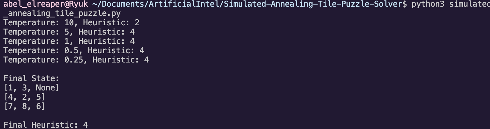

# Simulated Annealing Tile Puzzle Solver

This repository contains a Python script, `simulated_annealing_tile_puzzle.py`, designed to solve a tile puzzle using the simulated annealing algorithm. The script takes an initial state and explores neighboring states, accepting moves that lead to states with better heuristic values and occasionally accepting worse moves based on the Metropolis criterion.

## Tile Puzzle Problem

The tile puzzle involves arranging a set of numbered tiles into a specific order, typically from an initial, disorderly state. The goal is to reach a target state with a predefined order of tiles.

## Usage

1. **Clone the repository:**

```bash
git clone https://github.com/abelxmendoza/Simulated-Annealing-Tile-Puzzle-Solver.git
```

*2. Navigate to the repository:*

```bash
cd Simulated-Annealing-Tile-Puzzle-Solver
```

3. **Run the simulated annealing script:**

```bash
python3 simulated_annealing_tile_puzzle.py
```

4. **Follow the on-screen prompts to provide the initial state and observe the solver's exploration of neighboring states.**

## Tile Puzzle States

### Initial State

```plaintext
 | 1 |   | 3
  | 4 | 2 | 5
  | 7 | 8 | 6
```

### Next State 1 (Top Row | | 1 | 3):

```plaintext
|   | 1 | 3
  | 4 | 2 | 5
  | 7 | 8 | 6
```

Heuristic h2 Value: 4

[Additional details about the state, if available]

### Next State 2:

```plaintext
 | 1 | 2 | 3
  | 4 |   | 5
  | 7 | 8 | 6
```

Heuristic h2 Value: 2

[Additional details about the state, if available]

### Next State 3:

```plaintext
  | 1 | 3 |   |
  | 4 | 2 | 5
  | 7 | 8 | 6
```

Heuristic h2 Value: 4

[Additional details about the state, if available]


## Output Example



## Parameters and Customization

Adjust the parameters in the script to control aspects such as the initial temperature, cooling schedule, and the maximum number of iterations. Experiment with different settings to observe the solver's behavior.

## Contribution

Contributions are welcome! If you have suggestions, improvements, or bug fixes, feel free to open an issue or submit a pull request.


## Documentation

[https://docs.google.com/document/d/1h4M-IueEFTKt-olsMWisFFHuS9oMp9TwNNQRK9h1DY0/edit?usp=sharing](https://docs.google.com/document/d/1h4M-IueEFTKt-olsMWisFFHuS9oMp9TwNNQRK9h1DY0/edit?usp=sharing)

## License

This project is licensed under the [MIT License](https://chat.openai.com/c/LICENSE).

## Acknowledgment

I would like to express my gratitude to Professor Kenytt Avery for teaching CPSC 481-05 - Artificial Intelligence at California State University Fullerton. This exercise has provided valuable insights into simulated annealing and problem-solving in the field of artificial intelligence.

Thank you, Professor Avery, for your guidance and support throughout this assignment.

Happy solving!
